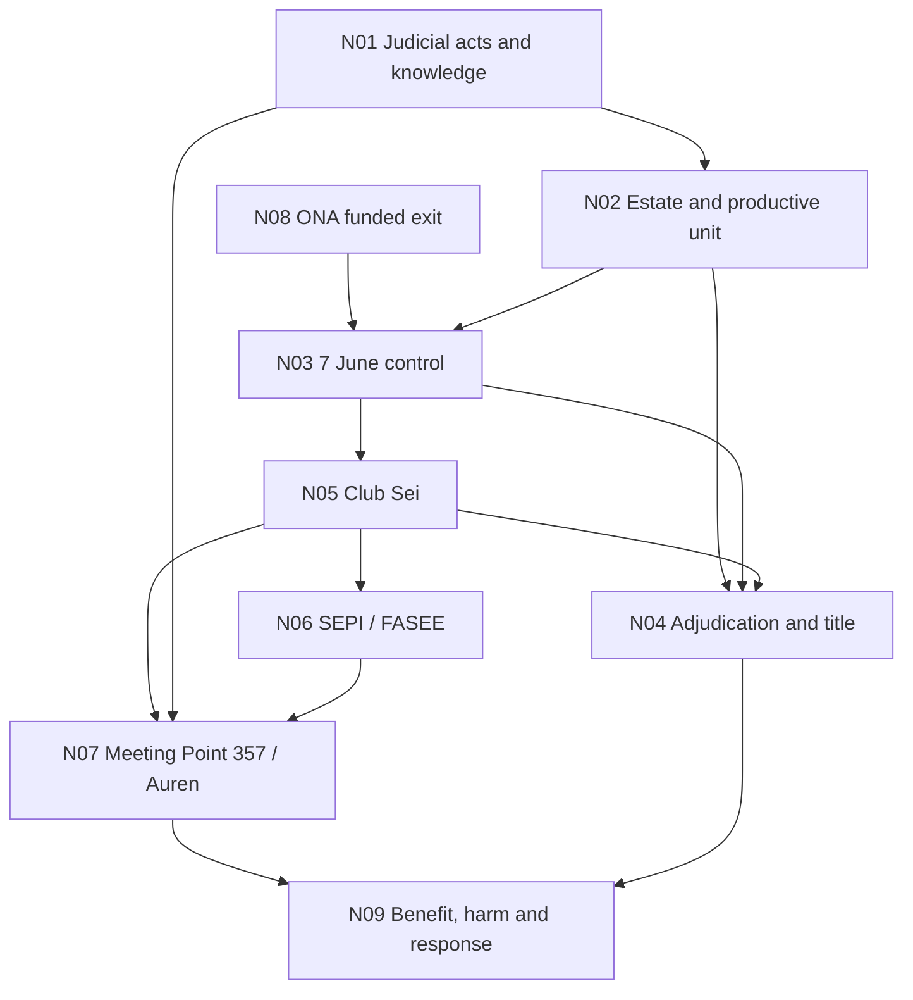

# Ilmo. Sr. D. Alberto López Villarrubia, Magistrado-Juez del entonces Juzgado de lo Mercantil n.º 1 de Las Palmas de Gran Canaria / Meeting Point 357/2024 — multidirectional criminal-first evidence matrix

**Control:** `PD-ALV-MP357-MULTI-20260827-01`
**Control date:** 27 August 2026
**Status:** `REPOSITORY-CONTROLLED / PUBLIC-SAFE / CRIMINAL-FIRST / FALSIFIABLE`
**Machine control:** `assets/data/alberto-meeting-point-357-multidirectional-evidence-v1.json`

## Scope and reading rule

This specialist module reads the record in both directions:

1. **forward:** source → evidence-status-qualified proposition → permissible inference → criminal element → possible consequence; and
2. **backward:** observable consequence → causal bridge → record that should exist → custodian → falsification test.

It preserves Gil Marer and Aweswell's deliberate allegation that the attributed
Meeting Point 357/2024 involvement of the magistrate López Villarrubia crossed a
line already crossed in Concurso 36/2012. It does not convert that allegation
into proof that the magistrate signed the 24 October act, acted in substitution,
had a statutory conflict, concealed information, knowingly issued an unjust
decision, owed SEPI a personal disclosure duty or caused creditor/public loss.

The exhaustive specialist caret census across the two hubs, machine matrix,
human matrix, specialist audit and authority plan is **25/32 — 7 pending —
PARTIAL, NOT ALL IS^**. The repository-wide unitary census remains separately
**19/24 — PARTIAL, NOT ALL IS^**. A caret resolves identity only.

The linked first-hop evidence corpus is separately exhaustive across the
eighteen reciprocal primary routes: **56/130 confirmed, 74 pending — PARTIAL,
NOT ALL IS^**. Its 130-object denominator is 27 people, 64 organisations or
expressly controlled perimeters, 25 institutions or sub-organs and 14
proceedings. It neither replaces the six-surface 25/32 result nor changes the
repository-wide 19/24 result. The complete object and source-needed queue is
`assets/data/caepr-caret-alberto-meeting-point-first-hop-v1.json`.

## Multidirectional map

Each arrow is bidirectional as an evidential test: the forward direction asks
whether one evidence-status-qualified node supports the next inference; the reverse direction asks
which complete record would defeat, narrow or confirm the alleged bridge.

## Node matrix

| Node | Source-supported fact | Permissible investigative inference | Criminal-first gate | Strongest contrary explanation | Decisive falsification / production | Reciprocal endpoint links |
|---|---|---|---|---|---|---|
| `AM357-N01` — actor/capacity/supervision | Signed 2012–2021 acts place the magistrate López Villarrubia in Concurso 36/2012 and record later works, access, inspection, expert, conservation and liquidation questions. LPB alone was the debtor. | Fixes actor, dated capacity and documented notice of stated allegations in signed acts; permits testing whether supervision left a material evidential deficit. | Exact decision/duty, personal adoption, objective or manifest injustice, historically applicable mental element, capacity and causation. | The 26-Jun-2018 suspension, 24-Oct-2019 refusal of convalidation, preservation of Aweswell's standing, partial correction of deficient reasoning, reasoned orders, administrator responsibility and remedial routes. | Certified docket plus act–request–proof–knowledge–duty–appeal–result matrix. | [E01 ↔ N02 ES](../es/concurso-36-2012-masa-activa-2018-2021/#contradiccion) / [EN](../en/insolvency-36-2012-active-estate-2018-2021/#contradiction); [E09 ↔ N07 ES](../es/cuaderno-juridico/meeting-point-357-2024-trazabilidad-judicial/#registro) / [EN](../en/legal-notebook/meeting-point-357-2024-judicial-traceability/#register) |
| `AM357-N02` — estate/productive unit | The liquidation architecture distinguished LPB assets from third-party assets and contemplated publicity/improvement; 2020/2021 orders refused inspection/expert evidence and relied on administrator conservation. | Tests whether the absence of a resulting property–photo–damage–value baseline in the controlled record affected conservation, valuation, competition or recovery of the operating layer; the certified docket could complete or rebut the gap. | Ineffectiveness/error is not crime; omission requires a concrete duty, knowledge, practical capacity, causal equivalence and required intent. | The suspension/non-convalidation record, mixed ownership, LPB-only perimeter, photo-identification failure, administrator competence and no bidder inspection request. | Property/interior/owner/works/damage/value map; administrator requests; expert evidence; accounts; productive-unit assets, contracts, income and goodwill. | [E01 ↔ N01 ES](../es/concurso-36-2012-magistrado-juez/#ledger) / [EN](../en/insolvency-36-2012-mercantile-court-1/#ledger); [E02 ↔ N03 ES](../es/toma-control-sun-park-7-junio-2018/#hechos-7-junio) / [EN](../en/sun-park-takeover-7-june-2018/#events-of-7-june); [E04 ↔ N04 ES](../es/adjudicacion-2022-reconstruccion-documental/) / [EN](../en/2022-adjudication-documentary-reconstruction/) |
| `AM357-N03` — 7 June control | The record preserves a disputed material control/exclusion operation and an incomplete authority chain; Community, administrator and CAM lanes remain distinct. | The alleged/reported restriction or loss of access and operation may connect to works, information asymmetry, rescue disablement and later commercialisation. | Identify who ordered, authorised, executed, knew or ratified each act and who had a concrete legal duty and practical capacity to prevent it, with actor-specific authority, intent, benefit and harm. | Security, conservation and limited-management explanations; the provisional criminal archive and Order 804/2018 are adverse procedural material; no recovered direct instruction or common criminal purpose. | Instructions, security contracts, communications, access logs, keys, inventories and person–act–time map. | [E02 ↔ N02 ES](../es/concurso-36-2012-masa-activa-2018-2021/#contradiccion) / [EN](../en/insolvency-36-2012-active-estate-2018-2021/#contradiction); [E03 ↔ N08 ES](../es/ona-hotels-salida-concurso-36-2012/expediente-unitario-abril-2018-octubre-2019/) / [EN](../en/ona-hotels-insolvency-exit-36-2012/unitary-record-april-2018-october-2019/); [E05 ↔ N05 ES](../es/lava-verde-club-sei-meeting-point/#cadena) / [EN](../en/lava-verde-club-sei-meeting-point/#chain); [E13 ↔ N04 ES](../es/adjudicacion-2022-reconstruccion-documental/) / [EN](../en/2022-adjudication-documentary-reconstruction/) |
| `AM357-N04` — adjudication/title | The third bidder did not attend, personate or lodge a bond; CAM's proposal was approved. Credit, value, set-off, payment, title and accounting are distinct. | A documented procedural node on the path toward title; tests whether earlier information/access/valuation deficits conditioned competition or result. | Procedural fraud needs a specific deception, author, knowledge, use, judicial error, disposition, benefit and harm; judicial attribution remains separate. | Documented bidder default, approved conditions and earlier protective/suspensive acts support a lawful-process explanation. | Hearing record, bid/bond, asset schedule, credit–value–payment–set-off–surplus ledger, deed, Property Registry / Registro de la Propiedad and accounting. | [E04 ↔ N02 ES](../es/concurso-36-2012-masa-activa-2018-2021/#contradiccion) / [EN](../en/insolvency-36-2012-active-estate-2018-2021/#contradiction); [E06 ↔ N05 ES](../es/lava-verde-club-sei-meeting-point/#cadena) / [EN](../en/lava-verde-club-sei-meeting-point/#chain); [E12 ↔ N09 ES](../es/reconstruccion-unitaria-autoridades-publicas/) / [EN](../en/public-authority-unitary-case-reconstruction/); [E13 ↔ N03 ES](../es/toma-control-sun-park-7-junio-2018/#hechos-7-junio) / [EN](../en/sun-park-takeover-7-june-2018/#events-of-7-june) |
| `AM357-N05` — Club Sei | Public/supplier sources support pre-title preparation, pilots and presentation at the Sun Park address; exact legal person, authority, bookings and revenue remain unknown. | Tests whether a Meeting Point/FTI actor acquired authority, information, commercial opportunity, benefit or custody linked to the disputed asset before title. | Exact legal person, act, authority, knowledge, intent, revenue/benefit and estate/third-party loss. | COVID postponement; marketing/pilots do not prove opening, bookings, revenue, whole-site authority, contract or crime. | NIF/entity, contracts, room/finca inventory, authority, PMS/OTA, bookings, invoices, commissions, payments and CAM/administrator communications. | [E05 ↔ N03 ES](../es/toma-control-sun-park-7-junio-2018/#hechos-7-junio) / [EN](../en/sun-park-takeover-7-june-2018/#events-of-7-june); [E06 ↔ N04 ES](../es/adjudicacion-2022-reconstruccion-documental/) / [EN](../en/2022-adjudication-documentary-reconstruction/); [E07 ↔ N06 ES](../es/fti-touristik-meeting-point-insolvencia-preconcurso-bluesea/#sepi) / [EN](../en/fti-touristik-meeting-point-insolvency-preinsolvency-bluesea/#sepi); [E08 ↔ N07 ES](../es/cuaderno-juridico/meeting-point-357-2024-trazabilidad-judicial/#registro) / [EN](../en/legal-notebook/meeting-point-357-2024-judicial-traceability/#register) |
| `AM357-N06` — SEPI/FASEE | Official records identify EUR 31m for Meeting Point: EUR 20.7m participating and EUR 10.3m ordinary; FASEE accounts give entity allocations. | If material Sun Park/Club Sei rights, risks or contingencies existed, tests public-credit disclosure, monitoring, custody and loss. | Identified declarant/obligor, duty, material falsehood/omission, knowledge, reliance, use and quantified loss; not automatically subsidy fraud. | No present Sun Park tracing, proven omission, impairment, harm or personal judicial SEPI duty. | Instruments, security, source/use, disclosures, monitoring, repayments, exposure, impairment and debtor/SEPI/Auren files. | [E07 ↔ N05 ES](../es/lava-verde-club-sei-meeting-point/#cadena) / [EN](../en/lava-verde-club-sei-meeting-point/#chain); [E10 ↔ N07 ES](../es/cuaderno-juridico/meeting-point-357-2024-trazabilidad-judicial/#registro) / [EN](../en/legal-notebook/meeting-point-357-2024-judicial-traceability/#register) |
| `AM357-N07` — 357/Auren | Three archived notice copies display an attribution of the 24-Oct extension to the magistrate López Villarrubia; signed Auto 97/2025 proves three debtors, corrected chronology, Auren request and Guillermo Fernández García's appointment order. Public notice authenticity and per-copy custody are not closed. | Triggers authentication, allocation, knowledge, Article 219 and disclosure/custody production; proves none of those disputed bridges. | CP 446 requires personal adoption, objective/manifest injustice, knowledge or intent and causation; CP 447 requires the historically applicable gross-negligence/inexcusable-ignorance test. Article 219 is separate. Any concealment theory requires an exact offence and duty. | Ordinary substitution, support, reassignment, correction or registry error; no statutory conflict ground presently proved. | Signed 18-Sep/24-Oct originals; metadata and allocation; abstention/recusal/disclosure; complete communication/annexes and Auren workfile. | [E08 ↔ N05 ES](../es/lava-verde-club-sei-meeting-point/#cadena) / [EN](../en/lava-verde-club-sei-meeting-point/#chain); [E09 ↔ N01 ES](../es/concurso-36-2012-magistrado-juez/#ledger) / [EN](../en/insolvency-36-2012-mercantile-court-1/#ledger); [E10 ↔ N06 ES](../es/fti-touristik-meeting-point-insolvencia-preconcurso-bluesea/#sepi) / [EN](../en/fti-touristik-meeting-point-insolvency-preinsolvency-bluesea/#sepi); [E11 ↔ N09 ES](../es/reconstruccion-unitaria-autoridades-publicas/) / [EN](../en/public-authority-unitary-case-reconstruction/) |
| `AM357-N08` — ONA exit | The record documents a proposed ONA–Clubotel–Aweswell/LPB funded-exit architecture with professional actors, subject to unresolved conditions, security, approval and drawdown. | Provides a counterfactual for whether control/exclusion and later decisions prevented that proposed architecture, and whether value or competition was affected. | Negotiation failure is not criminal interference; prove feasible conditions, authority, knowledge, causal act, purpose, benefit and quantified loss. | Missing closing/security/conditions; independent commercial or legal failure remains possible. | Term sheet, finance, security, authority, conditions precedent, closing/break chronology and court/administrator/creditor communications. | [E03 ↔ N03 ES](../es/toma-control-sun-park-7-junio-2018/#hechos-7-junio) / [EN](../en/sun-park-takeover-7-june-2018/#events-of-7-june) |
| `AM357-N09` — result/benefit/harm | The cited sources support the 2021 approval acts, a controlled reconstruction of the 2022 notarial transaction and the public-support context. This matrix does not establish the exact current beneficial title, current operator, income amount/recipient, distributions or the causal bridge between those lanes. | Reconstructs backward who benefited, which asset/right changed, which record should exist and what causation/loss can be measured. | Offence-by-offence and actor-by-actor proof: act/omission, duty/authority, knowledge/intent, nexus, benefit, injured party, quantum and no double recovery. | The adjudication may have been lawful; documented bidder default, reasoned decisions and missing documentary bridges remain real limits. Any later investment, capex or professional-operation proposition requires its own direct source. | Title/beneficial-owner chain, current operator, capex, income, finance, distributions, claimant–finca–loss–remedy ledger, complete institutional decisions and value counterfactual. | [E11 ↔ N07 ES](../es/cuaderno-juridico/meeting-point-357-2024-trazabilidad-judicial/#registro) / [EN](../en/legal-notebook/meeting-point-357-2024-judicial-traceability/#register); [E12 ↔ N04 ES](../es/adjudicacion-2022-reconstruccion-documental/) / [EN](../en/2022-adjudication-documentary-reconstruction/) |

## Source-spine controls

- `AM357-N03` is controlled by `OA-07`, `OA-09`–`OA-12` in
  `archive/SUN_PARK_PRE_7JUN2018_ONSITE_APPROACHES_EVIDENCE_REGISTER_20AUG2026.md`,
  `J7-06`, `J7-09` and `J7-10` in
  `archive/SUN_PARK_7JUN2018_RUNUP_SOURCE_INGEST_17AUG2026.md`, and the
  `ME-044/045/046/048/050` plus `ME-CAM7J` production controls. The unrelated
  controls `ME-028/029/030` are expressly forbidden for this node.
- `AM357-N08` is controlled by `PD-ONA-FX-20260826-01`, particularly
  `ONA-FX-001`–`003` and `ONA-FX-005`–`009`, in
  `archive/evidence/ONA_FUNDED_EXIT_UNITARY_FACT_RECORD_20260826.md`, together
  with `ME-084` and `ME-CAM7J-007`. The unrelated controls `ME-031/032` are
  expressly forbidden for this node.
- `AM357-N06` uses the official 27-Jun-2022 SEPI release and the 2023 FASEE
  annual accounts. `AM357-N07` uses the controlled signed Auto 97/2025,
  `LV-12` and aggregate controls for three archived register-notice copies;
  public Git does not contain the Auto binary or a reproducible per-copy
  full-hash notice manifest. `AM357-N09` confines its
  cited proof to the adjudication/deed reconstruction and public-support
  context; current operation, current beneficial title and income require their
  own direct records.

## Edge tests

The machine control owns thirteen explicit edges. The highest-value reverse tests
are:

- **357 attribution → 36/2012 knowledge:** obtain the signed 24-Oct original and
  reparto/substitution/support/correction metadata before alleging a personal act.
- **Current benefit → adjudication:** reconstruct credit, value, payment, set-off,
  title, capex, income and distributions before inferring benefit or loss.
- **SEPI exposure → Club Sei:** obtain debtor disclosures, source/use, monitoring
  and Auren workpapers before alleging an omission or public loss.
- **Club Sei → control:** obtain the exact entity, contract, authority, access and
  payment chain before treating marketing as exploitation.
- **Control / Club Sei → adjudication:** obtain complete access, information,
  valuation, rescue, contract, title and bid records before alleging that either
  control/exclusion or pre-title commercial positioning conditioned the result.
- **Failed ONA exit → 7 June control:** obtain finance/security/condition records
  before attributing failure to interference.

## Controlling boundaries

- Economic unity does not merge legal persons, estates, titles, proceedings,
  acts, knowledge, intent or liability.
- Later title, operation, benefit or public finance does not retroactively prove
  an earlier offence.
- The current record does not establish knowing judicial injustice, an improper
  relationship, a statutory Article 219 ground or a personal judicial duty to
  notify SEPI.
- Production capable of defeating the allegation must be displayed with the same
  prominence as incriminating evidence.
- The identity registry's exact S.L.U. debtor names do not absorb earlier S.L. or
  differently spaced source literals without NIF/registry/name-history proof.
