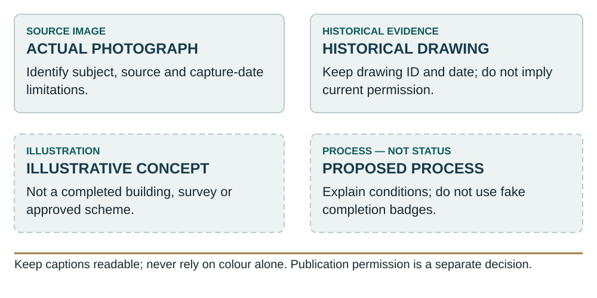

# Capital visual disclosure standard

Public-safe implementation control: `SRLN-ISM-VIS-20260927-IMPL-01`.

This directory contains reusable design rules and an explanatory key. It does not contain a private admission document, terms, financial scenarios, source photographs, property drawings, investor information or private storage locators. No new public investor journey or subscription route is established. The controlling private documents remain outside this public repository.

## Evidence and illustration

Every figure needs a caption, source/provenance, status and a readable text equivalent. Distinguish an actual photograph, a historical drawing, an illustrative concept and a proposed process. An actual photograph does not establish ownership; a historical drawing does not establish current planning permission. Renderings must not be presented as completed buildings or verified site views. Dashed connections represent proposals, not executed guarantees, security, ownership or transfers.

## Document hierarchy

Use a restrained set of legal-structure, funds-flow, ranking, commitment-to-issue, repayment and distinct-asset figures in the main admission document. Put richer imagery in a separate visual project dossier; legible historical plans and provenance in technical exhibits; and responsibilities, disclosure stages and reporting fields in an administration guide. Companion material is not automatically incorporated by reference. A Pricing Supplement and existing legal/valuation annexes retain their separate functions.

## Presentation

White reading pages, black body text, navy headings, deep-teal secondary headings and muted-gold separators. Use labels and line patterns as well as colour. Keep source captions next to images and avoid shrinking legal/risk text to accommodate artwork. Use selectable body text, native headings and links; do not flatten the legal document into screenshots. Inspect colour and grayscale outputs. The stylesheet is opt-in and does not modify the public site's global styles.

## Verification and release

Record the source identifier and checksum privately, exact legal-document insertion point, actual native object, source/status caption and access class. Export the edited native document and inspect the rendered figure pages. Keep editable SVG/HTML/build sources in the controlled source package. Do not reuse mock holdings, invented progress percentages, old issuer labels or unverified security badges. Do not make a map's broad locality marker look like a surveyed parcel boundary.

Source reuse rights, factual verification and counsel/release review remain separate from visual completion. Do not publish private appendices, source-only tabs, KYC or other investor records. Repository merge is not securities admission, issue, settlement, legal sign-off or funding. A non-custodial administration concept is not a live authenticated portal or appointed paying/registrar service.

## Sources and scope

The January 2026 LSE ISM Rulebook is the legal source to check for applicable disclosure and prescribed notice requirements; this design standard is not an Exchange approval or additional rule. W3C colour/contrast guidance is an accessibility benchmark, not represented as an ISM-specific mandate.

- [ISM Rulebook](https://docs.londonstockexchange.com/sites/default/files/documents/attachment_1_n0226.pdf)
- [W3C: Use of Color](https://www.w3.org/WAI/WCAG22/Understanding/use-of-color.html)
- [W3C: Contrast (Minimum)](https://www.w3.org/WAI/WCAG22/Understanding/contrast-minimum.html)

Local structural check: `python3 docs/capital-visual-disclosure/check.py`. This only checks this public-safe package; it does not certify legal compliance, permissions, screen-reader behavior or private documents. For private/public persistence boundaries, see [the workspace runbook](../WORKSPACE_PERSISTENCE_RUNBOOK.md).
