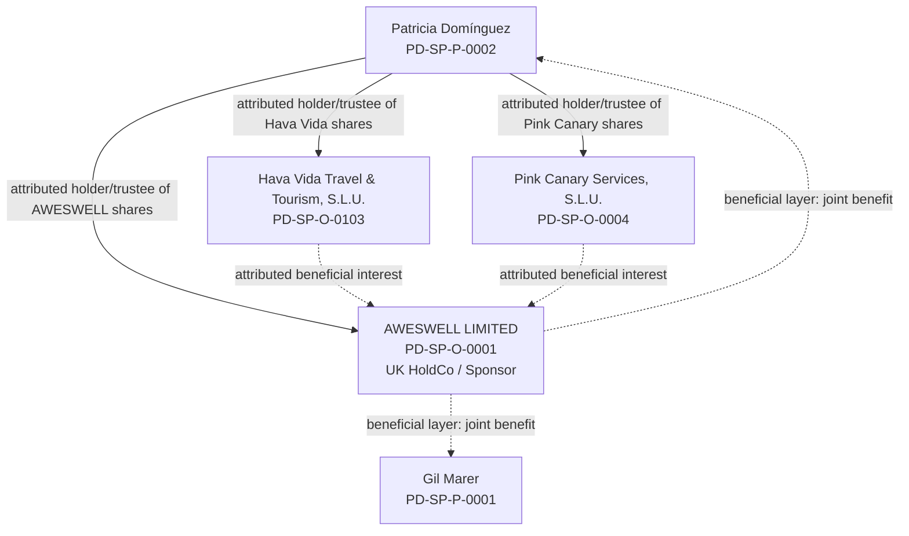

# AWESWELL group ownership / beneficial-position overlay

Control: `PD-AW-GROUP-BENEFICIAL-LAYERS-20261006-01`  
Date: 6 October 2026  
Status: **ACTIVE — ATTRIBUTED BENEFICIAL POSITIONS / LEGAL-SOURCE BRIDGES OPEN**

This overlay sits beneath the existing public relationship architecture. It does **not** replace the legal-entity register and it does not convert an attributed beneficial/economic position into registered legal title.

## Canonical entities

- **Gil Marer** — `PD-SP-P-0001`
- **Patricia Domínguez** — `PD-SP-P-0002`
- **AWESWELL LIMITED** — `PD-SP-O-0001`, UK company 07716847
- **Pink Canary Services, S.L.U.** — `PD-SP-O-0004`
- **Hava Vida Travel & Tourism, S.L.U.** — `PD-SP-O-0103`

## Two separate trust / beneficial layers

### Layer 1 — AWESWELL LIMITED shares

Gil Marer's attributed position is that **Patricia Domínguez has been holding the shares in AWESWELL LIMITED on trust for the joint benefit of Patricia Domínguez and Gil Marer**.

This is the **UK HoldCo-share layer**.

It is not the same proposition as the ownership/economic position concerning Hava Vida or Pink Canary.

### Layer 2 — Hava Vida and Pink Canary shares

Gil Marer's separate attributed position is that **Patricia Domínguez has been holding the shares of Hava Vida Travel & Tourism, S.L.U. and Pink Canary Services, S.L.U. effectively on trust for the benefit of AWESWELL LIMITED**.

This is the **Spanish-company-share layer**.

The beneficiary asserted at this layer is **AWESWELL LIMITED**, not Gil and Patricia directly.

## Org-chart view

## Hard non-collapse rule

1. **AWESWELL-share proposition:** Patricia → AWESWELL shares → Patricia + Gil jointly.
2. **Spanish-company-share propositions:** Patricia → Hava Vida shares / Pink Canary shares → AWESWELL.
3. The two layers are related economically but are not the same trust, the same shares or the same beneficiary proposition.
4. Registered legal title, historic registered shareholding, beneficial/equitable ownership, project perimeter and legal trust effect must remain separate fields.

## Proof boundary

These positions are recorded as **Gil Marer's attributed factual/economic position**. They do not by themselves establish:

- a legally effective express, resulting, constructive or other trust;
- the current registered shareholder position in AWESWELL, Hava Vida or Pink Canary;
- the exact proportions of beneficial interests in AWESWELL;
- governing law or recognition of a trust over Spanish-company shares;
- PSC / UBO filings;
- tax or accounting treatment; or
- transfer of legal title.

Required source bridges include the relevant share registers, confirmation statements / registry certificates, trust or nominee instruments if any, contemporaneous conduct and correspondence, funding/accounting records, PSC/UBO records and jurisdiction-specific legal analysis.

## Controlling data

- `assets/data/hava-vida-aweswell-relationship-v1.json`
- `assets/data/chatgpt-master-memory-v1.json`
- `assets/data/matter-identity-registry-v1.organisations.json`
- `assets/data/matter-identity-registry-v1.people.json`

The existing public **Strategic Financial Relationship** chart remains a functional relationship architecture, not a cap table or legal-title certificate.

## 7 October 2026 — downstream accounting / PAP / audit propagation

Control: `PD-HV-PINK-DOWNSTREAM-20261007-01`.

### Registered / legal-title side

For current architecture and professional scoping, treat **Patricia Domínguez as the registered/legal-title holder side of the Hava Vida / Pink Canary relationship**, subject to the source ceiling:

- Hava Vida: official incorporation evidence establishes Patricia as sole shareholder at incorporation.
- Pink Canary: the controlled shareholder-book evidence records Patricia's holding.
- Current Spanish registry/shareholder evidence remains required before stating a stronger current registered-title conclusion.

This is not permission to state that Patricia's present 2026 legal title is independently certified if the current certificate/shareholder record has not yet been obtained.

### Beneficial / equitable side

Gil Marer's controlling attributed position remains that **Patricia held the Hava Vida and Pink Canary shares effectively on trust for the benefit of AWESWELL LIMITED** (`PD-HV-AW-TRUST-001`; `PD-PINK-AW-TRUST-001`).

Keep this as an attributed beneficial/equitable position until the legal/source bridge establishes the legally effective mechanism, governing law and Spanish recognition.

### Blind reconstruction requirement

The primary ownership/control analysis must be capable of being run with Gil's and Patricia's present retrospective testimony removed:

1. before / during / after contemporaneous documents;
2. share title and registers;
3. funding and bank flows;
4. actual strategic and operational control;
5. accounting/tax treatment;
6. risk-bearing and economic benefit;
7. adviser/third-party descriptions;
8. subsequent conduct, without using hindsight to manufacture an earlier legal interest.

Gil's and Patricia's present accounts may explain or confirm the documentary result, but must not be the primary evidential foundation. Contrary evidence must be preserved.

### Mandatory downstream propagation

This ownership architecture must be visible, with the same proof boundary, in:

- **SRLN-2026 Annex Y** and the PAP ownership/group-structure disclosure package;
- AWESWELL **balance-sheet reconstruction/restatement** and consolidation-perimeter workpapers;
- the independent **audit / Rule 8.2 accountant/auditor scope** supporting the proposed listed loan-note programme;
- professional scoping communications with **BDO** or another appointed accountant/auditor.

For accounting purposes, do not recognise an AWESWELL investment, subsidiary net assets, consolidation date or value merely because the management beneficial/equitable position is recorded. Determine actual reporting-date control and the applicable accounting treatment from evidence and the relevant standards.

For external professional communications, state the two layers and ask the professional team to determine the accounting/legal treatment. Do not describe the trust/equitable position as independently established merely because it is canonically registered as management's position.
