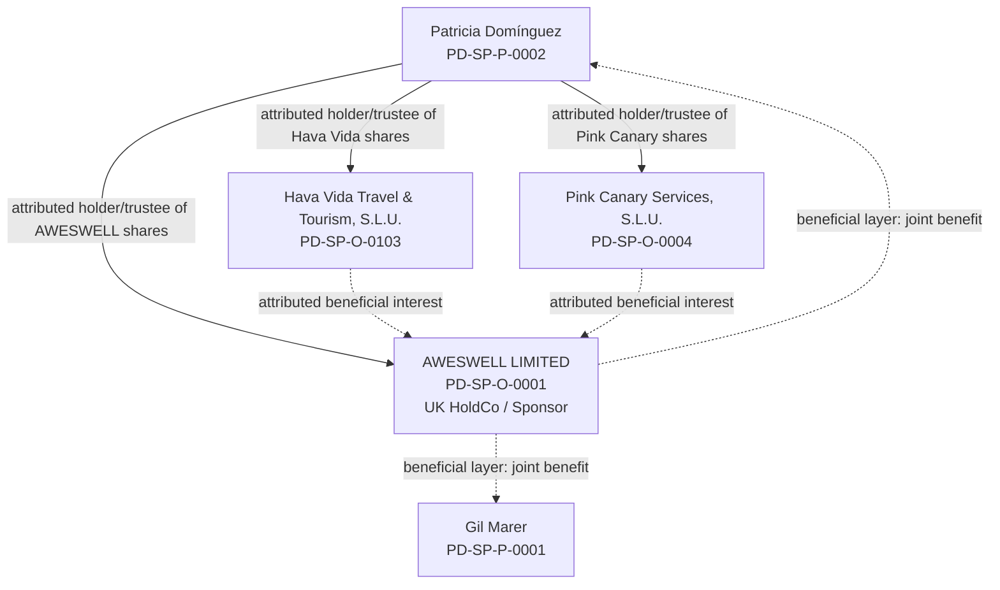

# AWESWELL group ownership / beneficial-position overlay

Control: `PD-AW-GROUP-BENEFICIAL-LAYERS-20261006-01`  
Date: 6 October 2026  
Status: **ACTIVE — ATTRIBUTED BENEFICIAL POSITIONS / LEGAL-SOURCE BRIDGES OPEN**

This overlay sits beneath the existing public relationship architecture. It does **not** replace the legal-entity register and it does not convert an attributed beneficial/economic position into registered legal title.

## Canonical entities

- **Gil Marer** — `PD-SP-P-0001`
- **Patricia Domínguez** — `PD-SP-P-0002`
- **AWESWELL LIMITED** — `PD-SP-O-0001`, UK company 07716847
- **Pink Canary Services, S.L.U.** — `PD-SP-O-0004`
- **Hava Vida Travel & Tourism, S.L.U.** — `PD-SP-O-0103`

## Two separate trust / beneficial layers

### Layer 1 — AWESWELL LIMITED shares

Gil Marer's attributed position is that **Patricia Domínguez has been holding the shares in AWESWELL LIMITED on trust for the joint benefit of Patricia Domínguez and Gil Marer**.

This is the **UK HoldCo-share layer**.

It is not the same proposition as the ownership/economic position concerning Hava Vida or Pink Canary.

### Layer 2 — Hava Vida and Pink Canary shares

Gil Marer's separate attributed position is that **Patricia Domínguez has been holding the shares of Hava Vida Travel & Tourism, S.L.U. and Pink Canary Services, S.L.U. effectively on trust for the benefit of AWESWELL LIMITED**.

This is the **Spanish-company-share layer**.

The beneficiary asserted at this layer is **AWESWELL LIMITED**, not Gil and Patricia directly.

## Org-chart view

## Hard non-collapse rule

1. **AWESWELL-share proposition:** Patricia → AWESWELL shares → Patricia + Gil jointly.
2. **Spanish-company-share propositions:** Patricia → Hava Vida shares / Pink Canary shares → AWESWELL.
3. The two layers are related economically but are not the same trust, the same shares or the same beneficiary proposition.
4. Registered legal title, historic registered shareholding, beneficial/equitable ownership, project perimeter and legal trust effect must remain separate fields.

## Proof boundary

These positions are recorded as **Gil Marer's attributed factual/economic position**. They do not by themselves establish:

- a legally effective express, resulting, constructive or other trust;
- the current registered shareholder position in AWESWELL, Hava Vida or Pink Canary;
- the exact proportions of beneficial interests in AWESWELL;
- governing law or recognition of a trust over Spanish-company shares;
- PSC / UBO filings;
- tax or accounting treatment; or
- transfer of legal title.

Required source bridges include the relevant share registers, confirmation statements / registry certificates, trust or nominee instruments if any, contemporaneous conduct and correspondence, funding/accounting records, PSC/UBO records and jurisdiction-specific legal analysis.

## Controlling data

- `assets/data/hava-vida-aweswell-relationship-v1.json`
- `assets/data/chatgpt-master-memory-v1.json`
- `assets/data/matter-identity-registry-v1.organisations.json`
- `assets/data/matter-identity-registry-v1.people.json`

The existing public **Strategic Financial Relationship** chart remains a functional relationship architecture, not a cap table or legal-title certificate.
